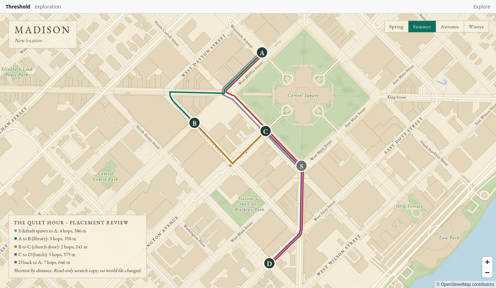

# Proposal: "The Quiet Hour", a four-place Madison mystery

Date: October 10, 2026. Status: **story and placement proposal for the designer's review. Nothing has been written to any world file.** Built only from the existing interaction model ([gameplay-interactions.md](gameplay-interactions.md)): declared discoveries, `requires`, one scene per interaction, choices that grant discoveries. No new engine features.

## Premise

The player carries a receiver. Near the Capitol Square it ticks once, then falls silent, then ticks again forty seconds later. The trail leads through a municipal archive, a church boiler room and a sealed city-works hatch, and ends at a threshold the player may or may not open. It is the first step toward the null-zone material in the game design, kept to a single hidden stair so nothing downstream is committed. Tone: bureaucratic unease, ordinary afternoons, nothing explained.

**The scene text names no real building or organisation.** It says "the library", "the church off the Square", "the maintenance concourse". The real sites below are only where the designer chooses to place them, so a place can be swapped without rewriting a word, and no real institution is implicated by the fiction. Characters are invented.

## Structure

Four places, seven interactions, seven discoveries, one branch and two endings:

```
A  The Square  --pulse-->  B  The library  --conduit-->  C  The church door  --key-->  D  The hatch  --ending-->  A
                              two ways to learn it         two ways to be believed      open it or leave it shut
```

| Place | Interaction | Requires | A choice grants |
|---|---|---|---|
| **A** The Square | `int:pulse` "A pulse under the Square" | nothing | `disc:pulse` (both choices) |
| **B** The library | `int:bulletin` "Municipal bulletins, 1974" | `disc:pulse` | read it yourself: `disc:conduit` + `disc:copy`; ask the night clerk: `disc:conduit` + `disc:clerk` |
| **C** The church door | `int:caretaker-copy` "The boiler-room door" | `disc:conduit`, `disc:copy` | `disc:key` |
| **C** The church door | `int:caretaker-clerk` "The boiler-room door" | `disc:conduit`, `disc:clerk` | `disc:key` |
| **D** The hatch | `int:hatch` "A hatch the colour of the pavement" | `disc:key` | open it: `disc:threshold`; leave it shut: `disc:marked` |
| **A** The Square | `int:after-open` "The Square, afterward" | `disc:threshold` | nothing (closing note) |
| **A** The Square | `int:after-shut` "The Square, afterward" | `disc:marked` | nothing (closing note) |

The branch at B decides which of the two C scenes a player sees (only one is ever offered), and the choice at D decides which closing note appears. Replaying with **New walk** shows the other branch. The scenario is complete when one closing note has been investigated; no extra flag is needed. Every discovery is required by something, so the lint is clean by design.

## Draft text

Each scene is short on purpose (the panel is narrow). A discovery's label is the line the player sees in the "Noted" outcome, so labels are written as clues.

**`int:pulse` at A. Scene: "Forty seconds"**
> The receiver in your coat has been silent since State Street. Here, at the edge of the Square, it gives one short tick, and then nothing. You wait. Forty seconds later, one tick again.
>
> The afternoon goes on around you: a vendor folding an umbrella, a pigeon walking the kerb like an inspector. Nobody else is listening.

Choices: *Crouch by the drain grate and listen* · *Hold the receiver against the pavement*. Both grant `disc:pulse`: **"The pulse repeats every forty seconds, and it is louder toward the library."**

**`int:bulletin` at B. Scene: "The microfilm room"**
> The reader is still warm from the last person who used it. The 1974 works bulletins are in a grey box that has been opened more often than any other in the row.
>
> Page nine carries a single notice: a conduit "sealed pending inspection", with a time of day and no date. 4:40. Below it, someone has pencilled a number in the margin: *40*.

Choices:
- *Photocopy the notice and read it through* grants `disc:conduit` **"The notice places the sealed conduit beneath the municipal maintenance concourse."** and `disc:copy` **"You have a photocopy of the 1974 notice."**
- *Ask the night clerk about the pencilled number* grants `disc:conduit` (same label) and `disc:clerk` **"The night clerk remembers someone asking about the same notice, long ago, and was not surprised."**

**`int:caretaker-copy` at C. Scene: "The boiler-room door"**
> A man in a cardigan holds the door with his foot, the way people do when they have been interrupted. You show him the photocopy. He reads it twice, then looks at your receiver, not at you.
>
> "Forty seconds," he says. "It was thirty when I started."

Choice: *Take the key he offers* grants `disc:key` **"Mr. Pell gave you a brass service key stamped M.U.W. 4-40."**

**`int:caretaker-clerk` at C. Scene: "The boiler-room door"**
> The man in the cardigan is already at the door. "The library telephoned," he says. "Marguerite doesn't telephone about much."
>
> He listens to your receiver for a full forty seconds without being asked to, and nods at the tick as if it were a late bus.

Choice: *Take the key he offers* grants `disc:key` (same label).

**`int:hatch` at D. Scene: "A hatch the colour of the pavement"**
> Between two planters behind the maintenance concourse there is a steel hatch painted to match the ground. The key fits as if it were cut yesterday.
>
> In your hand the receiver goes quiet. Not low: silent, like a held breath.
>
> You could open it. You could also write it down and leave it for someone with more nerve. Either way, you will remember which.

Choices:
- *Open it, and look down* grants `disc:threshold` **"Below the hatch is a stairwell lit from somewhere that is not a lamp. It is warmer than the street. The interval has changed, and the Square is where you first heard it."**
- *Leave it shut, and mark it for someone else* grants `disc:marked` **"You marked the hatch on your map and left it shut. The receiver is still counting. The Square is where it started."**

**`int:after-open` at A. Scene: "The Square, afterward"**
> The pulse has stopped. At 4:40 the clocks on the Square disagree with each other by exactly forty seconds, and nobody looks up.

Choice: *Write it down*.

**`int:after-shut` at A. Scene: "The Square, afterward"**
> You wait out the forty seconds. The tick does not come. Somewhere under the paving, a door closes on a stair you did not take.

Choice: *Walk on*.

## Placement (your existing places, read-only)

I read your `authored.json` and the generated geography **without changing anything**. Your 60 places are almost all still named "New location", so I looked for places that sit beside notable named buildings, and tested walking routes between them on the authored graph (all candidates are connected). These are suggestions only; I have not named, moved or repurposed any place.

| Slot | Suggested place | Beside | Why |
|---|---|---|---|
| **A** The Square | `loc:b8e5c4e0738c` (alternative `loc:4795e6f024e6`, in the park, a longer walk) | the Capitol Square | The first stop, and where the story closes. |
| **B** The library | `loc:9663ad011a8d` (alternative `loc:77a3476ebbe3`) | Central Library | An archive scene at a library. |
| **C** The church door | `loc:d9bff30b26bf` | Grace Episcopal Church | A side door and a boiler room. |
| **D** The hatch | `loc:a6b00c477718` | the State Street maintenance concourse | Municipal infrastructure, close to the library (3 to 4 hops). |

The final read-only review below supersedes the hop counts from the first pass (those minimised hops; the figures below are shortest by distance).

**What I need from you:** the four places (or others you prefer), and whether to give them names. Interactions work on unnamed places, but the "Nearby" list only shows named ones, so a name or note is what makes the place inspectable on the way past. Suggested names, if you want them: "The east walk of the Square", "The library microfilm room", "The church's side door", "The maintenance concourse hatch". I will not edit `authored.json`; renaming is yours in the editor.

## What happens once you approve

1. You confirm the story (or send edits to the text, which is the cheapest thing to change) and the four places.
2. I write `priv/worlds/madison/interactions.json` (a new file; `authored.json`, the boundary and the generated snapshots are untouched) and run `mix threshold.interactions` to lint it against your authored world.
3. I playtest it on a scratch copy of the world and a scratch database, both branches and both endings, and report what I saw.
4. You apply the pending database migration (see `docs/local-gameplay.md`) and play it for real.

## Open questions

1. **Real settings.** Keep the real landmarks as placement hints with a text that names none (recommended), or name them in the scenes.
2. **Length and tone.** Roughly 400 to 500 words across seven scenes; say if you want it longer, stranger or drier.
3. **The branch.** Two ways to be believed (copy or clerk) is the only branching beyond the ending at D; more branching means more scenes written per path.
4. **A character.** Mr. Pell and the clerk are named in passing. The portrait and simple-dialogue design (see the interactions memo) would let them appear properly later; nothing here depends on it.
5. **Later chapters.** The open hatch is deliberately a doorway to the null-zone material without committing to it; a later chapter would add interactions requiring `disc:threshold`.

## Final placement review (read-only; October 10, 2026)

**All four places are suitable. Recommendation: proceed**, with the two small text corrections and one optional spawn change below. Method: a scratch copy of the world, the authored graph compiled exactly as `/play` does, shortest walks over it, and geometry checks against the generated context. Nothing in your `authored.json`, boundary, symlink or snapshots was changed. Annotated map: `docs/quiet-hour/placement-map.png` (A to D with their routes, S for the default spawn).



| Slot | Place | Sits on | Nearest named feature | Verdict |
|---|---|---|---|---|
| **A** | `loc:b8e5c4e0738c` | Wisconsin Avenue at the Square's northwest corner | Capitol Square, 23 m | Good: the Square's edge, and a natural place to begin and end. |
| **B** | `loc:9663ad011a8d` | West Mifflin Street | Central Library, 11 m (Overture Center 14 m) | Good: a library door. The scene says only "the library", so the neighbouring arts building does no harm. |
| **C** | `loc:d9bff30b26bf` | the Carroll Street side of the Square | Grace Episcopal Church, 28 m (Capitol Square park, 6 m) | Good: a church side street. It is also a crossroads, see below. |
| **D** | `loc:a6b00c477718` | South Henry Street at West Doty Street | the mapped maintenance concourse, 14 m | Good for the hatch (see the one correction below). |

**Routes (all legal and connected; shortest by distance):** the default spawn to A is 4 hops (386 m); A to B 3 hops (358 m); B to C 2 hops (241 m); C to D 5 hops (379 m; 4 hops if you prefer fewest, at 449 m); D back to A 7 hops (646 m; 6 hops at 716 m). That is a first-play walk of about 21 hops and 2.0 km in total (4 + 3 + 2 + 5 + 7 hops). Both extra route facts matter:

- **Every route is inside the playable boundary**, as are all four standing points and the spawn (checked against the diamond boundary geometry, not just the routing rules).
- **C is a crossroads.** The routes from the spawn to A and from D back to A both pass through C, and the C-to-D route passes the default spawn's place. So the player walks past the church door at least twice before it matters, and its scenes stay hidden until their discoveries exist, which is fine. It also means the return trip from the hatch already takes the player past a place with something to say; a later optional observation there (not needed now) would suit the pacing.
- **The route A to B passes two of your named intersections** (State St x Mifflin St x Carroll St and State St x Dayton St x Pinckney St), which gives the walk some texture for free.

**One geographic correction.** D is 401 m from State Street itself; the building the map calls "Mall Concourse/State Street Maintenance" is a block south at Henry and Doty. A player who knows Madison would notice the label "on State Street". The draft text above is therefore corrected to say only "the municipal maintenance concourse".

**The opening.** The default spawn (`spawn:db793a6a4228`, at `loc:2b29e1f7aa45`) is at the south corner of the Square: 4 hops from A, and only 3 hops from D, with no hint to go to A. Your existing second spawn (`spawn:7058fdc6ab34`, at `loc:e92bf77667c8`, beside State Street) is **2 hops and 244 m from A**, a far better start. I recommend you make that spawn the default in Studio ("Make default"); I will not edit it. Keeping the current default also works, since A is the only place with anything to investigate at the start, but a first-time player is more likely to find it from the closer spawn.

**Does the player understand why returning matters?** Yes, with the pointers added to the hatch scene and its two outcomes above (the receiver is still counting; the Square is where it started). On arrival back at A the investigate panel offers "Something here can be investigated", and A already shows "Investigated" for the first scene, so the new closing note reads as a continuation. No quest marker is needed.

## Story-state shortcuts and limits to document

- **`disc:key` is a story-state shortcut, not inventory.** It records that the player was given the brass key. There are no items, quantities, transfers or consumption; if the game later gains a real inventory, this content can be migrated deliberately.
- **Each interaction completes once.** The hatch decision cannot be reconsidered without **New walk**. That is acceptable for the first scenario and is the reason the hatch text frames the choice as one the player will remember.
- **Choices are not individually gated.** The two branches at C exist as two interactions with different requirements, because the model gates interactions, not choices.

## What needs your approval

1. **The four places**, as in the table above (all suitable; recommendation: proceed).
2. **The two text corrections**: the conduit label no longer says "on State Street", and the hatch scene and its choices carry the deliberate-choice and return pointers above.
3. **Optional, your action in Studio:** make `spawn:7058fdc6ab34` the default spawn.
4. **Go-ahead** for me to write `priv/worlds/madison/interactions.json` (a new file), lint it, and playtest both branches and both endings on a scratch copy before you play it.

The scenes name no real building or organisation, and the settings are placement references only.
